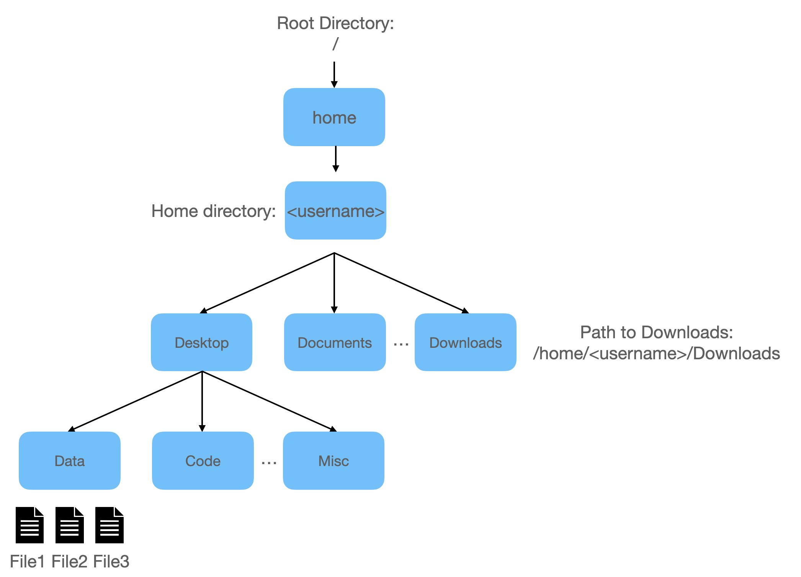

# A Introduction to the UNIX Shell for Bioinformatics

This is a brief introduction on how to use the UNIX Shell and perform tasks on the [Ibex](https://www.hpc.kaust.edu.sa/ibex) cluster of KAUST.

## Table of Content
- [Introduction](#introduction)
- [A bit of nomenclature](#a-bit-of-nomenclature)
- [Accessing the Shell](#accessing-the-shell)
- [Navigating Files and Directories](#navigating-files-and-directories)
- [Working With Files and Directories](#working-with-files-and-directories)
- [Little Diversion: Download this tutorial to your machine](little-diversion-download-this-tutorial-to-your-machine)
- [Loops](#loops)
- [Pipes and Filters](#pipes-and-filters)
- [Shell Scripts](#shell-scripts)
- [IBEX](#ibex)
- [Resources](#resources)

## Introduction

The Unix shell has been around longer than most of its users have been alive. It has survived so long because it’s a powerful tool that allows people to do complex things with just a few keystrokes. More importantly, it helps them combine existing programs in new ways and automate repetitive tasks so that they don’t have to type the same things over and over again. Use of the shell is fundamental to using a wide range of other powerful tools and computing resources including high-performance computing (HPC) such as [Ibex](https://www.hpc.kaust.edu.sa/ibex). This tutorial will get you started towards using the shell effectively.

In bioinformatics application the shell is most commonly used in combination with scripts written in the programming languages R and Python to implement more complex data wrangling and analysis tasks, as well as workflow management tools such as snakemake. The structure in which we will cover these topics is shown in the schema below, together with the links to the ressources:


- [**Fundamental Skills in Bioinformatics Course**](kaust.edu.sa)
- [**Shell tutorial**](https://github.com/roblehmann/shell-for-bioinformatics)
- [**Snakemake tutorial**](https://github.com/roblehmann/snakemake-tutorial)

## A bit of nomenclature

We need to talk briefly about a few terms that are usually used synonymously but refer to different things.

* **GUI:** Most programs today are accessed via a graphical user interface, or GUI in short. This has not always been the case, early computers did not have the ressources to offer a graphical output. They relied on written statements for interaction between the computer and its user.

* **Terminal:** Terminals are devices that allow the input into or output from the computer. They used to electromechanical devices which are separate from the computer. However, in modern computers terminals are program and thus also called terminal-emulator, emulating the functionality of it's electromechanical predecessors.

* **CLI:** The command line interface (CLI) is a program that receives the commands entered by a user via the terminal and provides them to the shell.

* **Shell:** A shell is a program that takes the user input and executes the required commands. There are different shell implementations, such as bash (Bourne Again SHell), sh, and zsh.


## Accessing the Shell

**Mac**
The Mac operating system comes with the Unix Shell and the program Terminal preinstalled. To open the Terminal:

Applications -> Utilities -> Terminal
Or Type Terminal in the Spotlight Search

If you want to check which shell is running in your terminal, type the command: `echo $SHELL`

**Linux**
Linux operating systems come usually with the Unix Shell and a Terminal preinstalled. How to start a terminal depends on the Linux desktop environment.

**Windows**
Windows does provide a shell called PowerShell but it's commands differ from the UNIX syntax. However, Linux programs can be installed via the Windows Subsystem for Linux (WSL). WSL allows Linux systems (e.g. Ubuntu) to be used as Windows applications. Alternatively, you can install [GitBash](https://git-scm.com/download/win).

## Navigating Files and Directories

The part of the operating system responsible for managing files and directories is called the file system. It organizes our data into files that represent the actual information, and directories, also called folders, that contain files or other directories. It might sound trivial, but keeping the folder structure well organized and file and folder names informative is crucial for conducting more complex task.

**Important Note:** 
We will now run commands on the shell which typically have short names like "ls" or "head". When you try to run a command but get an error message like the following, check the spelling of the command first and then whether the program you are trying to run is actually installed on your machine.

```
$ lsa
bash: lsa: command not found
```

### Where are we?

Let’s find out where we are in the file system by running a command called `pwd` which stands for **print working directory**. This is the directory that the computer assumes we want to excute a command in unless we explicitly specify another directory. 

```
$ pwd
/home/lehmanr
```

This is our home directory, called like the username on this machine. When opening a new shell, the current working directory is usually set to the home folder, if the shell is not configured otherwise.

To understand what a home directory is, let's have a look at how the file system as a whole is organized. The figure below illustrates an example file hierarchy. In the following we will learn how to traverse the filesystem, explore it, and manipulate it's content.



### What is here?

When using a shell CLI, we cannot simply double click a folder. We have to use the shell command `ls`, which stands for “listing”, to list the content of the folder we are currently in. `ls` by default prints the names of the files and directories in the current directory in alphabetical order.

```
$ ls
bin  _Inline  intel  lib  local  ncbi  perl5  Projects  R	tmp
```

We can provide the `ls` command with different parameters to adjust the output and make it more informative. Let's explore the following: `ls -l`. The parameter "-l" will show additional details of the files. We can combine flags to do multiple things at a time, like sort by time (-t), list all the details (-l), and display the file size in human readable format (-h).

```
$ ls -l
total 60
drwxr-xr-x   2 lehmanr g-lehmanr  4096 Aug 30  2017 bin
drwxr-xr-x   3 lehmanr g-lehmanr  4096 Oct 22  2017 _Inline
drwxr-xr-x   3 lehmanr g-lehmanr  4096 Mar 29  2018 intel
drwxr-xr-x 127 lehmanr g-lehmanr 12288 Mar  5 23:38 lib
drwxr-xr-x   4 lehmanr g-lehmanr  4096 Oct 19  2021 local
drwxr-xr-x   3 lehmanr g-lehmanr  4096 Nov 19  2017 ncbi
drwxr-xr-x   5 lehmanr g-lehmanr  4096 Feb  5  2020 perl5
drwxr-xr-x   2 lehmanr g-lehmanr  4096 Feb 20 14:44 Projects
drwxr-xr-x   4 lehmanr g-lehmanr  4096 Jul 26  2017 R
drwxr-xr-x  12 lehmanr g-lehmanr  4096 Jun 28  2022 tmp
```

### Let's go there!

In addition to looking at the files inside directories, we can also change our location to a different directory, so that we are no longer located in our home directory. The command to change directories is called `cd`. The `cd` command takes an argument which is the directory name.

In order to move into the directory "Desktop" that is by default located in our home directory:

```
$ cd Desktop
```

We can now use the `pwd` command to see if we have moved in the file structure tree:

```
$ pwd
/home/lehmanr/Desktop
```


### Relative vs Full Paths

As we have seen above, directories in the file systems are arranged into a hierarchy. The absolute path to a directory starts from the root directory "/" and moves down the hierarchical tree, successively combinnig the folder names until the file or directory of interest, separating each name by a "/". However, paths can also be specified relative to the current working directory of the shell. In relative paths, the current working directory is referred to as `.` while the parent directory of the current working directory is `..`. So assuming we are currently in `/home/lehmanr/Desktop`, in order to move to the parent directory we can either use the absolute path for the cd command, `cd /home/lehmanr`, or simply use `cd ..` instead.


### How to get Home

To go home, we could type the full path `/home/<username>` but that is laborious. The special symbol `~` serves as an abbreviation of the absolute path to the home directory `/home/<username>`. Equivalent to `~` calling the `cd` command without specifying any path will also change the curent working directory to the home folder. Thus, all these three commands will take you home no matter where you are in your file system:

```
$ cd /home/<username>
$ cd ~
$ cd
```

### Summary

This is a little graphical summary of how to traverse the file system tree in a shell:


### Command autocomplete

We just learned a few shorthand notations that save us time typing. Another very useful shortcut is refered to as tab completion. When typing a directory or file name, we can type the first few character then hit the tab button and our computer will automatically add the following unique characters.

## Working With Files and Directories

### Creating Directories

Let's create a subfolder on our Desktop, first navigate to the Desktop folder and then use the command `mkdir` to create the folder tmp_data, then use `ls` to verify the result: 

```
cd ~/Desktop
mkdir tmp_data
ls -l
```

As mentioned above, naming folder and files appropriately can make life easier for you. Firstly, avoid names that can look like program parameter to the CLI

- Don’t use spaces, rather "-" or "_"
- Don’t begin the name with a dash "-"
- Avoid special characters, use letters, numbers, . (period or ‘full stop’), - (dash) and _ (underscore).

### Creating Files

We can now move into the folder we have just created and create a text file, using several methods:

```
cd tmp_data
touch test.txt
nano test2.txt
ls
```

### Removing Files and Folders

Removing the newly created file is easy with the `rm` command:

```
rm test.txt
```

The `rm` command can also be used to remove directories, let's try that. We have to first move in the parent folder and then call rm:

```
$ cd ..
$ rm tmp_data/
rm: tmp_data/: is a directory
```

The error message tells us that we are trying to remove a directory which can contain files or other directories. We have to provide the parameter for recursive removal `rm -r` to achieve the desired goal here:

```
rm -r tmp_data/
```
### Moving Files and Folders

If we don't want to keep an original copy, we use the `mv` command to **move** or to **rename** files. We use the syntax `mv`:

```
$ mkdir tmp
$ mv tmp tmp_data
$ cd tmp_data
$ touch test.txt
$ mv test.txt test.csv
$ ls
$ mkdir data
$ mv test.txt data
```

### Copying Files and Folders

We use the `cp` command to make a copy files. If you want to copy a file into the same directory then used something like `cp <oringinal_filename.txt> <new_filename>`. For example:

```
$ cp test.csv test.csv.bak
$ ls
```

### Wildcards

In cases where we want to apply a command to more than one file for example, we can avoid retyping the command with every file by using wildcards. * is a wildcard, which represents zero or more other characters. Assume we want to start a data analysis project in the folder my_project, which contains three data files:

```
$ mkdir my_project
$ cd my_project
$ touch sample_A.csv
$ touch sample_B.csv
$ touch sample_C.csv
```
Now we realize we would like to keep the folder sturcture organized by keeping the data files in a separate data folder instead of the project root folder. Instead of calling the mv command three times, we can instead use the `*` wildcard in a single call:

```
$ mkdir data
$ mv sample_*.csv data
$ ls -l
```

The `*` is only one of many wildcards. Another wildcard character similar to the `*` is the questionmark `?`, which matches any single character. To expand on this topic have a look at one of the many source, e.g. [O'Reilly's Unix Power Tools](https://docstore.mik.ua/orelly/unix/upt/ch15_01.htm).

### File and Directory names and paths

Bash provides several convenient functions to manipulate file and directory names and paths.

`basename` - extract file/dir name from full path

```
$ basename ~/Projects/shell-for-bioinformatics/data/SRR2627019.1m.10xR1.fq.gz
SRR2627019.1m.10xR1.fq.gz
```

`dirname` - extract path, remove file/dir name

```
$ dirname ~/Projects/shell-for-bioinformatics/data/SRR2627019.1m.10xR1.fq.gz
/Users/lehmanr/Projects/shell-for-bioinformatics/data
```

`realpath` - obtain full path to file/dir
```
$ basename ~/Projects/shell-for-bioinformatics/data/SRR2627019.1m.10xR1.fq.gz
/Users/lehmanr/Projects/shell-for-bioinformatics/data/SRR2627019.1m.10xR1.fq.gz
```
### Parameter expansion

Dealing with file path strings often requires manipulating substrings, e.g. replacing extensions or adding sample names. Bash provides several functions for this purpose.

`${inputString/pattern/replacement}` - replace the first occurrence of pattern in the inputString with the replacement. E.g, alter this fastq's file name to fit the standard:
```
$ f='SRR2627019.1m.10xR1.fq.gz'
$ echo ${f/fq/fastq}
SRR2627019.1m.10xR1.fastq.gz
```
`${inputString//pattern/replacement}` - replaces all occurrences of pattern
```
$ echo ${f//1/_}
SRR26270_9._m._0xR_.fq.gz
```
Conventiently, we can also use wildcards in string, e.g. to remove everything in the file name following the dot:

```
$ echo ${f%%.*}
SRR2627019
```
In general: 

`${inputString} - access variable`
`${inputString/pattern/replacement}` - replace substring
`${inputString%%.*}` - remove longest matching suffix
`${inputString##.*}` - remove longest matching prefix
`${inputString:offset:length}` - extract by position

### Inspecting files with head, tail, cat, and less

We just made two files, but how do we look at them? Let's explore a few of the many ways.
We know how to create text files, but how do we learn what they contain? There are several programs that we can use to inspect a file's content in the shell.

- `head -n5 <filename>` prints the **first** 5 (i.e. any chosen number) lines of the input file on the screen
- `tail -n5 <filename>` prints the **last** 5 (i.e. any chosen number) lines of the input file on the screen
- `cat <filename>` prints the content of the **entire file** to the screen, this can take a long time for large files!
- `less <filename>` allows to view, but not edit the content of a file. This works well also for large files. Use up and down keys for navigation, q to exit.

### Redirecting output from a command into a file

In addition to receiving the output of a command on the screen as we have done until now, it is also possible to redirect the output to a file using the `>` operator. We can for example store the content of the current directory in a file. Note that the output file is created if it does not exist already, and it's content will be overwritten if it does exist:

```
$ ls . > dircontent.txt
$ cat dircontent.txt
```

We can also append to the content of a file using the `>>` operator:

```
$ ls . >> dircontent.txt
$ cat dircontent.txt
```

In a similar fashion, input to a command can be redirected. Find more on this topic in the [GNU Bash manual](https://www.gnu.org/software/bash/manual/html_node/Redirections.html).

### Writing to Standard Output

We can use the `echo` command to print data to the screen, like "Lorem ipsum."

```
$ echo "Lorem ipsum."
Lorem ipsum.
```

On the first glance, that doesn't look immensly useful. However, combined with a redirect we can use it to write a file without using an editor:

```
$ echo "The quick brown fox " > fox.txt
$ cat fox.txt
```

or append something to a file:

```
$ echo "jumps over the lazy dog" >> fox.txt
$ cat fox.txt
```

### Compressing Files

Bioinformatics in particular deals with large amounts of data, e.g. read data from sequencing genomes or transcriptomes. While this read information is usually stored in plain text files using formats like [fasta](https://www.ncbi.nlm.nih.gov/genbank/fastaformat/) or [fastq](https://www.ncbi.nlm.nih.gov/sra/docs/submitformats/#fastq-files), large amounts of storage space can be saved if these plain text files are compressed. We can use the command `gzip <filename>` to compress any text file, and `gunzip <filename>.gz` to uncompress. By default, both commands remove the input files after completing the (de-)compression but the parameter `-k` will instruct the program to keep the input.

```
$ ls -laht . > dircontent.txt
$ gzip dircontent.txt
$ ls dircontent.txt*
```

Note that the contents of a compressed file are not human-readable anymore, i.e. inspecting them with head, cat, less, or nano will not work. But in case of very large (e.g. read-)files, uncompressing them first is not practical either. We can instead use the command `zcat` to uncompress the the file and then direct it to the screen output.

```
$ cat dircontent.txt.gz
$ zcat dircontent.txt.gz
```
### Finding text in files

A frequent task in bioinformatics is to find occurrences of a certain string in a file or set of files. With the program grep Unix provides a very power tool for this. ‘grep’ is short for ‘global/regular expression/print’ and works like this in its simplest form: `grep <string> <filename>`
We can use it for example to find all genes with a "CA" in their name in the gene list `data/genes.txt`:

```
$ grep 'CA' data/genes.txt
CACNA1A
CAT
CACNA1A
CACNA1A
```

grep offers a few useful options:
   `-n` add line numbers or occurrences;
   `-w` look for complete words;
   `-i` ignore cases;
   `-v` invert search result.

## Little Diversion: Download this tutorial to your machine

Now that we have learned to access and use the shell for navigation, we can use it to download this tutorial to use some prepared files for further steps. The one requirement is that you have the version management system **git** installed. Follow the [installation guide](https://github.com/git-guides/install-git) for your operating system if you haven't done so already. Now let's download the code onto our Desktop:

```
$ cd ~/Desktop
$ git clone https://gitlab.kaust.edu.sa/lehmanr/shell-for-bioinformatics
$ cd shell-for-bioinformatics
$ ls -l
```

Notice the data folder containing some files we will have a look at in the rest of this tutorial.

## Loops

Loops are very useful tools to reliably execute operations even for large numbers of files or data in general. There are several loop types availabe, here we will focus on the for loop with its general structure:

```
$ for variable_name in var_values 
  do 
    command1 $variable_name 
    command2 $variable_name
    …
  done  
```
So far we have not encountered variables. In bash, variables are assigned using just their name, i.e., `var='some_text'`, but when refering to the variable later we need too use a leading $, i.e., `$var`. In the ocntext of a loop, we need to use a variable to distinguish what needs to be done in each iteration of the loop. As example, we can navigate to the tutorial folder we have just cloned on our local file system and iterate over the names of all files in the data folder with the extension ".fq.gz" to print them to the screen:

```
$ for f in data/*.fq.gz 
  do 
    echo $f 
  done
data/SRR2627019.1m.10xR1.fq.gz
data/SRR2627019.1m.10xR2.fq.gz
data/SRR2627019.1m.20xR1.fq.gz
data/SRR2627019.1m.20xR2.fq.gz
```

## Pipes and Filters

Rather than creating complex programs that do many different things, Unix programmers focus on creating simple tools that each do one job well. The simple tools can then be combined with one another to carry out more complex processes. This programming model is called “pipes and filters”. The key is that any program that reads lines of text from standard input and writes lines of text to standard output can be combined with every other program that behaves this way as well.

To illustrate this concept, let's first look at a few commands and then learn how to combine them to build a pipeline.

### wc

The word count command `wc <filename>` allows you to count the number of lines, words, and characters in a plain text file, returning the values in that order.
Let's test this on a simple example file, like a file with the content of the current directory as before:

```
$ ls -l > dircontent.txt
$ wc dircontent.txt
6      47     321 dircontent.txt
```
In this case, the file dircontent.txt contains 321 characters in 47 words and 6 lines. We can provide parameters to only obtain the number of lines (-l), character (-c), or words (-w) instead of all three. 

### sort

The sort command allows the sorting the output of commands or file contents in numerical or alphabetical order. We can test this on the `lengths.txt` file in the data folder:

```
$ sort data/lengths.txt
10
2
4
44
444
65
99
```

Note how the parameter -n activates numerical sorting:
```
$ sort -n data/lengths.txt
2
4
10
44
65
99
444
```
### uniq

The uniq command filters out adjacent matching lines in a file. We can use the command to analyze a list of gene names in the file `data/genes.txt`. Let's first have a look at the file, then count how many genes are in the file, and finally use uniq to check if any genes are mentioned multiple times:

```
$ head -n 4 data/genes.txt
A2M
ADCY5
CACNA1A
C1QA
$ wc -l data/genes.txt
18 data/genes.txt
$ sort data/genes.txt > genes_sorted.txt 
$ uniq genes_sorted.txt > genes_sorted_unique.txt 
$ wc -l genes_sorted_unique.txt 
12 genes_sorted_unique.txt
```

We find that some of the genes are named more than once, since the unique number of genes is only 12. We can also make a count table of genes and find, that e.g. IGF1 is mentioned 4 times.

```
$ uniq -c genes_sorted.txt
1 A2M
1 ADCY5
1 C1QA
3 CACNA1A
1 CAT
1 CETP
1 EGF
1 EMD
1 GHRHR
1 HDAC2
2 HTRA2
4 IGF1
```


### Piping 

A pipe (`|`) tells the shell that we want to feed the output of the command on the left as input to the command on the right without intermediate file. Considering the pipeline we have just built to count the number of occurrences in a gene list, avoiding the creation of 2 intermediate files would make the workflow much cleaner, turning it into one line of code. Let's first count how many unique genes are in the file:

```
$ sort data/genes.txt | uniq -c | wc -l
```

Now let's look at which genes are actually occurring multiple times, the second call of sort is sorting the table numerically in decreasing order:

```
$ sort data/genes.txt | uniq -c | sort -nr
   4 IGF1
   3 CACNA1A
   2 HTRA2
   1 HDAC2
   1 GHRHR
   1 EMD
   1 EGF
   1 CETP
   1 CAT
   1 C1QA
   1 ADCY5
   1 A2M
```

The possibility of combining multiple filters (programs like wc, sort, uniq, ...) via pipes (`|`) to build pipelines is what makes the shell such a valuable tool for bioinformatics as it allows to build very complex pipelines in a efficient and easy way.


From here on, you just need to read up on more filter programs to extend your toolkit for data analysis and manipulation in the shell. Most notable are the following programs: [grep](https://www.gnu.org/software/grep/manual/grep.html), [cut](https://man7.org/linux/man-pages/man1/cut.1.html), [awk](https://github.com/onetrueawk/awk), [bioawk](https://github.com/lh3/bioawk), [sed](https://www.gnu.org/software/sed/manual/sed.html).

### awk

awk is an interpreted programming language designed specifically to effiently process delimited text. Many data formats in Bioinformatics are delimited: bed, gff/gtf, wiggle, DEG tables in pipelines, and many more. In general, awk processes files according to the following steps:
1. iterates over file line by line 
2. input line split into fields using the defined delimiter
3. input line fields are compared to pattern 
4. matching lines are processed

The awk command is structured like this, optionally redirecting the output to a file:

```
awk options 'BEGIN{first action} selection_criteria {action}END{last action}' input_file > output_file
```

Blocks are defined with curly brackets, with the BEGIN block being executed only once at the beginning before processing the input file, and the END block after processing the input file. The selection criteria can be used to subset the lines of the input file, e.g. comparing numbers of searching to certain strings.

Consider our example from above counting the occurrences of a gene in a gene list:
```
$ sort data/genes.txt | uniq -c | sort -nr
   4 IGF1
   3 CACNA1A
   2 HTRA2
   1 HDAC2
   1 GHRHR
   1 EMD
   1 EGF
   1 CETP
   1 CAT
   1 C1QA
   1 ADCY5
   1 A2M
```
We can use awk to turn turn this slightly awkward format into a nice table, and filter it in the process. Let's say we are only interested in genes occurring more than 2 times:

```
$ sort data/genes.txt | uniq -c | sort -nr | awk '$1>2 {print}'
   4 IGF1
   3 CACNA1A
```

Next, we want to move the gene name into the first column and the count in the second column, note that we are changing the delimiter to a tab space:

```
$ sort data/genes.txt | uniq -c | sort -nr | awk '$1>2 {print $2"\t"$1}'
IGF1	4
CACNA1A	3
```

And finally a header line with column names, e.g. to parse the data into R later:
```
$ sort data/genes.txt | uniq -c | sort -nr | awk 'BEGIN{print "Gene\tCount"} $1>2 {print $2"\t"$1}'
Gene	Count
IGF1	4
CACNA1A	3
```

A common task in to count the number of reads in a fastq file, this can also be done in a quick and convenient way using awk:

```
$ zcat data/SRR2627019.1m.10xR1.fq.gz | awk '{s++}END{print s/4}'
17894
```

## IBEX

The high performance computing (HPC) cluster of the King Abdulla University of Science and Technology is called [IBEX](https://www.hpc.kaust.edu.sa/ibex). It is accessible via ssh on a set of access nodes running CentOS 7.9 as operating system. The job scheduling system [SLURM](https://slurm.schedmd.com/) is then used to assign submitted jobs to the individual cluster nodes for execution. The [IBEX Job script generator](https://www.hpc.kaust.edu.sa/ibex/job) was created to help you learn how to write the slurm scripts. You can find more information about the Ibex cluster in the [Hardware and Software stack](https://www.hpc.kaust.edu.sa/sites/default/files/files/public/Cluster_training/17_01_2019/1.IBEX_Hardware_and_Software-min.pdf) and the [training materials](https://www.hpc.kaust.edu.sa/ibex/training).

## Remote access via SSH and SCP

As already mentioned above, we need to use the command ssh to be able to connect to another computer and run a shell on it. The general structure of the command is `ssh <user_name>@<ip_address_or_domain>`, where you need to add your user name on the remote computer and it's address. Ibex offeres several login nodes with different addresses:

- `ssh <user_name>@ilogin.ibex.kaust.edu.sa` to access a Intel hardware-based login node
- `ssh <user_name>@alogin.ibex.kaust.edu.sa` to access a AMD hardware-based login node
- `ssh <user_name>@glogin.ibex.kaust.edu.sa` to access a GPU stack login node

This will allow you to log into a login node and start a shell there, but it will not allow you to transfer data back and forth. Accordingly, the second important task is to transfer files from your local computer to the cluster file system and back. For this you can use the command scp with the syntax `scp [OPTION] [user@]SRC_HOST:]file1 [user@]DEST_HOST:]file2`. Let's say we want to copy our gene id data file from our local file system to our home directory on the Ibex cluster file system, i.e. we specify the path to our local file as source first, and then the user name, address of the remote location and finally the location where the file is to be copied to:

```
scp ./data/genes.txt <user_name>@ilogin.ibex.kaust.edu.sa:~/Desktop
```

## Resources

- Software and Data Carpentry's excellent [Introduction to the Unix Shell](http://swcarpentry.github.io/shell-novice/)
- [Data Science at the Command Line](https://www.datascienceatthecommandline.com/) ([source code](https://github.com/jeroenjanssens/data-science-at-the-command-line))
- [The Bash Guide](https://guide.bash.academy/)
- [Bash Scripting Cheatsheet](https://devhints.io/bash)
- [Advanced Bash-Scripting Guide](https://www.tldp.org/LDP/abs/html/)
- [Awesome Shell](https://github.com/alebcay/awesome-shell)
- [Awesome Bash](https://github.com/awesome-lists/awesome-bash)
- [GNU Bash manual](https://www.gnu.org/software/bash/manual/)
- [GitBash](https://git-scm.com/download/win)
- [Git](https://github.com/git-guides/install-git)
- [IBEX](https://www.hpc.kaust.edu.sa/ibex)
- [SLURM](https://slurm.schedmd.com/)
